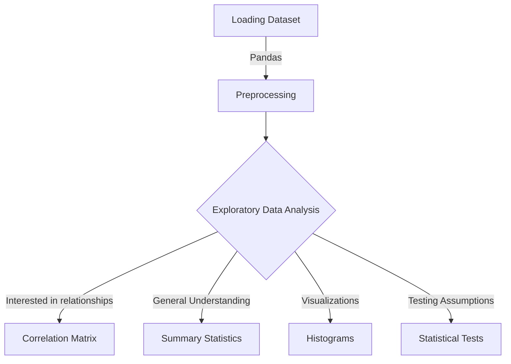

# datatree
Datatree is a swiss army knife python library that contains useful helper functions to help with data science related tasks such as exploratory data analysis, preprocessing and cleaning data, data mining, modeling, and more.

## Instructions

1. Run the following commands in the project's root directory to set up the virtual environment
+ run `poetry shell` to activate the virtual environment.

